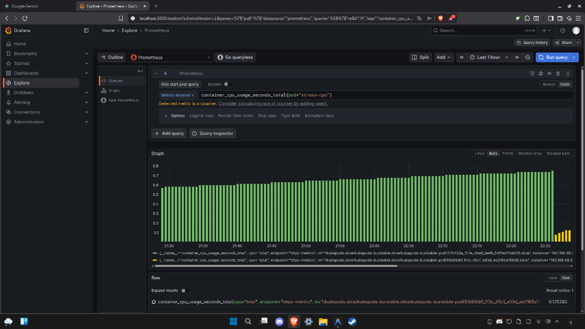

# Kubernetes Monitoring Lab - Online Boutique

  

Este projeto documenta a implementação de um ambiente Kubernetes local com a aplicação **Google Online Boutique**, monitorizado via **Prometheus** e **Grafana**, com alertas de infraestrutura configurados via código (IaC).

## Pré-requisitos
- [x] Docker & Minikube
- [x] Kubectl
- [x] Helm

## Como Reproduzir

### 1. Iniciar o Cluster
O cluster foi iniciado com recursos extra para suportar a stack completa de microsserviços e monitorização.
```bash
minikube start --cpus=4 --memory=8192 --disk-size=30g --driver=docker
```

### 2. Deploy da Aplicação (Online Boutique)
Utilizámos a demo oficial de microsserviços da Google para gerar tráfego real.

```bash
kubectl apply -f https://raw.githubusercontent.com/GoogleCloudPlatform/microservices-demo/main/release/kubernetes-manifests.yaml
```

### 3. Instalação da Stack de Monitorização
Implementação do kube-prometheus-stack (Prometheus, Grafana, Alertmanager e Node Exporter) via Helm.

```bash
helm repo add prometheus-community https://prometheus-community.github.io/helm-charts
helm repo update
kubectl create namespace monitoring
helm install stack-monitorizacao prometheus-community/kube-prometheus-stack -n monitoring
```

### 4. Configuração de Alertas (IaC)
Foi configurada uma regra PrometheusRule personalizada para detetar consumo elevado de CPU (>80% por 1 minuto).

Ficheiro: `alerta-cpu.yaml`

```yaml
apiVersion: monitoring.coreos.com/v1
kind: PrometheusRule
metadata:
  name: alerta-cpu-alto
  namespace: monitoring
spec:
  groups:
  - name: exemplos.regras
    rules:
    - alert: HighCPUUsage
      expr: sum(rate(container_cpu_usage_seconds_total{container!=""}[2m])) by (pod) > 0.8
      for: 1m
      labels:
        severity: critical
```

### 5. Teste de Carga (Stress Test)
Para validar o disparo do alerta, executámos um pod dedicado a gerar carga de CPU:

```bash
# Definimos limits/requests para garantir que o Kubernetes reporta o uso corretamente
kubectl run stress-cpu --image=polinux/stress --requests="cpu=200m,memory=100Mi" --limits="cpu=500m,memory=200Mi" -- -c 1
```

### 6. Configuração de Ingress (Acesso via Domínio)
Para aceder à loja através de um domínio local (`loja.diogo.local`):

1. **Ativar Ingress:** `minikube addons enable ingress`
2. **Aplicar Regras:** `kubectl apply -f ingress-loja.yaml`
3. **Iniciar Túnel (Num terminal separado):** `/home/corn/.local/bin/minikube tunnel` (pede senha sudo)
4. **Configurar Hosts (`/etc/hosts`):** Adicionar `<IP_DO_INGRESS> loja.diogo.local`
5. **Aceder:** http://loja.diogo.local

### 7. GitOps com ArgoCD (Single Source of Truth)
Implementámos o paradigma GitOps usando o ArgoCD. O estado desejado do cluster é definido neste repositório GitHub.

**Instalação:**
```bash
kubectl create namespace argocd
kubectl apply -n argocd -f https://raw.githubusercontent.com/argoproj/argo-cd/stable/manifests/install.yaml
```

**Acesso ao Painel:**
- **URL:** https://argocd.diogo.local
- **User:** `admin`
- **Senha:** (Ver secção Comandos Úteis)

**Teste de Auto-Cura (Self-Healing):**
O ArgoCD garante que o cluster está sempre sincronizado com o Git.
1. Apague um deployment manualmente: `kubectl delete deployment frontend`
2. Observe no ArgoCD: Ele deteta a falta do componente ("Out of Sync") e recria-o imediatamente.
3. Resultado: A loja mantém-se online e resiliente a "acidentes" manuais.

## Evidências

### Grafana Explore - Análise de Métricas
Abaixo é possível visualizar a recolha de métricas dos containers em tempo real.



## Comandos Úteis

**Aceder ao Grafana:**
```bash
kubectl port-forward svc/stack-monitorizacao-grafana 3000:80 -n monitoring
```

**Resgatar a senha de admin do Grafana:**
```bash
kubectl get secret --namespace monitoring stack-monitorizacao-grafana -o jsonpath="{.data.admin-password}" | base64 --decode ; echo
```

**Resgatar a senha inicial do ArgoCD:**
```bash
kubectl -n argocd get secret argocd-initial-admin-secret -o jsonpath="{.data.password}" | base64 -d; echo
```
